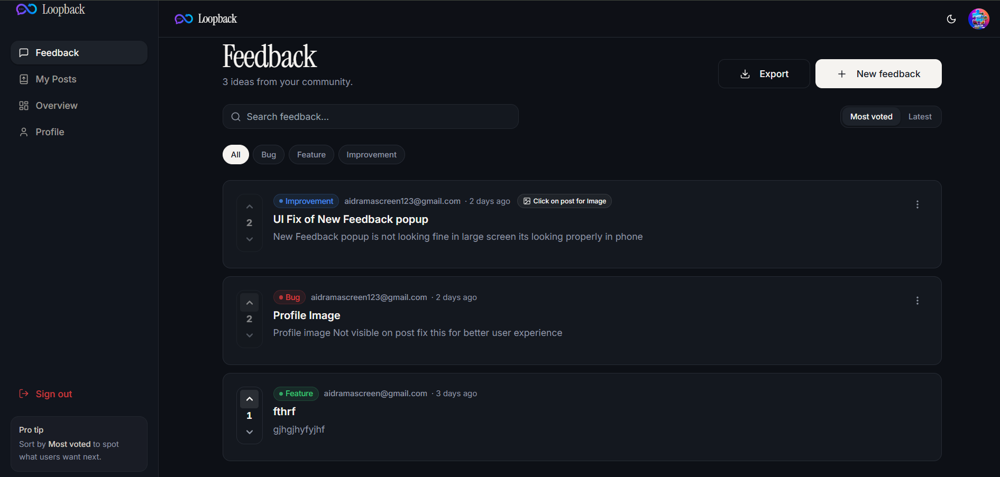
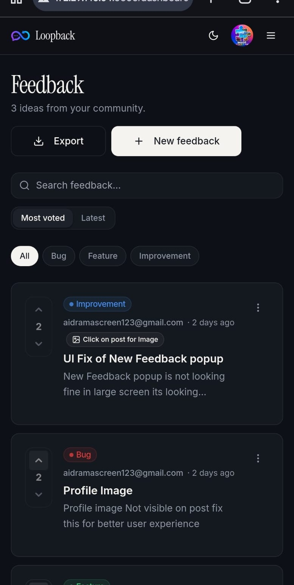

<h1 align="center">🌐 Loopback – Premium Feedback Tool</h1>

  

  
  
  

  Loopback is a production-grade feedback SaaS designed for product teams to collect, prioritize, and manage user insights with ease. 
  Built with a focus on <strong>Premium Aesthetics</strong>, <strong>Performance</strong>, and <strong>User Experience</strong>.

<h2 style="background: linear-gradient(90deg,#06b6d4,#9333ea); -webkit-background-clip: text; color: transparent;">✨ Key Features</h2>
<ul align="left">
  <li>🚀 <strong>Dynamic Feedback Loop:</strong> Seamless submission and tracking.</li>
  <li>🗳️ <strong>Voting System:</strong> Empower users to prioritize the roadmap.</li>
  <li>🏷️ <strong>Smart Categorization:</strong> Organize feedback with tags and status updates.</li>
  <li>🔒 <strong>Secure Auth:</strong> Integrated Supabase Authentication.</li>
  <li>🎨 <strong>Premium UI:</strong> Modern glassmorphism design with dark mode support.</li>
</ul>

<h2 style="background: linear-gradient(90deg,#9333ea,#06b6d4); -webkit-background-clip: text; color: transparent;">⚙ Tech Stack</h2>
<ul align="left">
  <li><strong>Frontend:</strong> React 18 + Vite + TypeScript</li>
  <li><strong>State Management:</strong> TanStack Query (React Query) + SWR</li>
  <li><strong>Styling:</strong> Tailwind CSS + Shadcn UI + Lucide Icons</li>
  <li><strong>Backend:</strong> Supabase (PostgreSQL, Auth, Edge Functions)</li>
  <li><strong>Deployment:</strong> Vercel</li>
</ul>

  
  
  
  

<h2 style="background: linear-gradient(90deg,#10b981,#06b6d4); -webkit-background-clip: text; color: transparent;">🧠 Project Architecture</h2>
<ul align="left">
  <li>📊 <strong>Overview:</strong> Dashboard with real-time feedback metrics.</li>
  <li>📝 <strong>Feedback Wall:</strong> Interactive list with voting and filtering.</li>
  <li>🛠️ <strong>Admin Console:</strong> Manage posts, assign tags, and update status.</li>
  <li>👤 <strong>Auth Flow:</strong> Secure login and profile management.</li>
  <li>📱 <strong>Responsive Layout:</strong> Optimized for all screen sizes.</li>
</ul>

<h2 style="background: linear-gradient(90deg,#9333ea,#10b981); -webkit-background-clip: text; color: transparent;">📸 Screenshots</h2>
<h3>💻 Desktop Experience</h3>

<h3>📱 Mobile Native Feel</h3>

<h2 style="background: linear-gradient(90deg,#10b981,#9333ea); -webkit-background-clip: text; color: transparent;">🎯 Highlights</h2>
<ul align="left">
  <li>⚡ <strong>Blazing Fast:</strong> Optimized with Vite and React Query.</li>
  <li>💯 <strong>Lighthouse Score:</strong> High performance, accessibility, and SEO.</li>
  <li>🧩 <strong>Modular Code:</strong> Reusable components following atomic design.</li>
  <li>🔍 <strong>SEO Ready:</strong> Full Open Graph support and meta optimization.</li>
</ul>

<h2 style="background: linear-gradient(90deg,#06b6d4,#9333ea); -webkit-background-clip: text; color: transparent;">📂 Folder Structure</h2>
<pre align="left">
LOOPBACK/
├── public/          # Static assets
├── src/
│   ├── components/  # Reusable UI components
│   ├── hooks/       # Custom React hooks
│   ├── integrations/# Supabase & API connections
│   ├── lib/         # Utilities & helpers
│   ├── pages/       # Route-level components
│   └── App.tsx      # Main application logic
├── supabase/        # Database migrations & config
├── package.json
└── tailwind.config.ts
</pre>

<h2 style="background: linear-gradient(90deg,#9333ea,#06b6d4); -webkit-background-clip: text; color: transparent;">🚀 Live Demo</h2>

👉 Explore Loopback: <a href="https://deepanshu-thakur-portfolio.vercel.app" target="_blank"><strong>deepanshu-thakur-portfolio.vercel.app</strong></a>

<h2 style="background: linear-gradient(90deg,#10b981,#9333ea); -webkit-background-clip: text; color: transparent;">💬 Author</h2>

<strong>Deepanshu Thakur</strong> 
Full Stack Developer

    
    
    
  

⭐ If you like this project, don’t forget to star the repo! 
<em>Your support helps me build more premium tools!</em>

